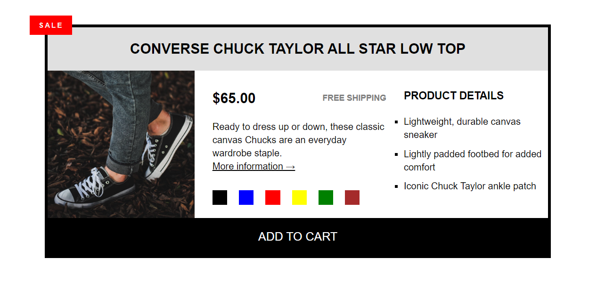

# Shoe-Component

This is a shoe component created using HTML & CSS . The layout is build using CSS Grid

### 
🎗🎗🎗 [Live Demo](https://enigm413.github.io/Shoe-Component/) 🎗🎗🎗

<<<<<<< HEAD
### Screenshot

=======

>>>>>>> d8f4ff7e5dc96738593eee347fda590d69336c1b
